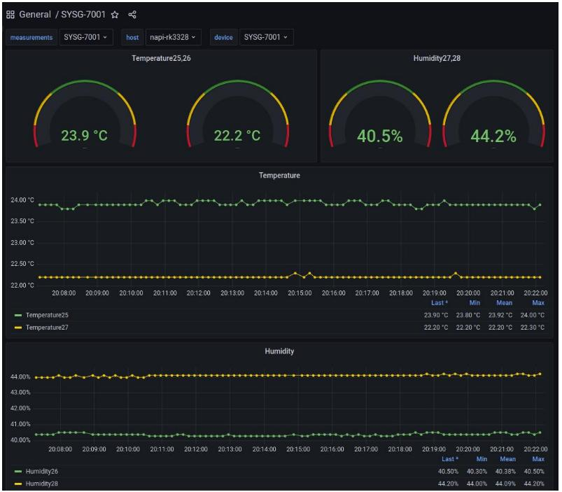
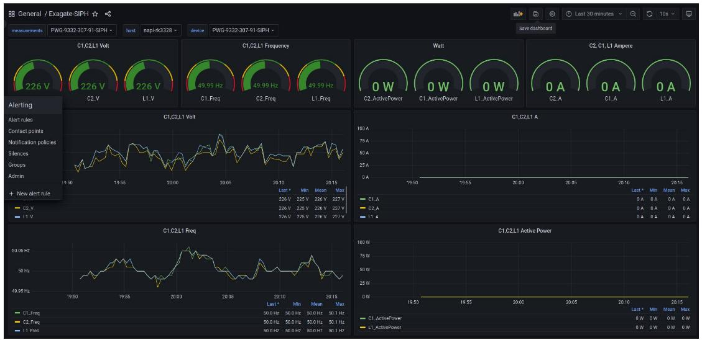
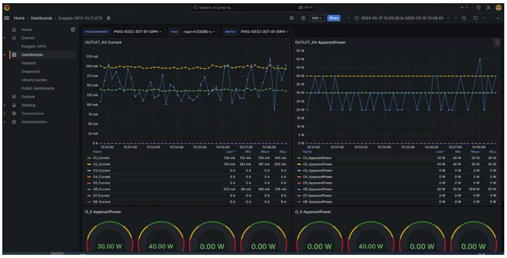
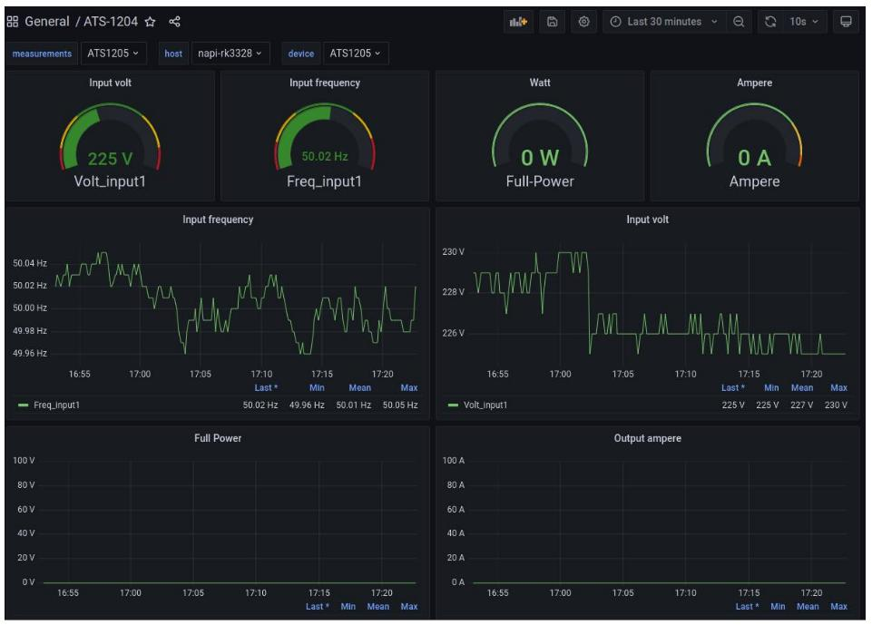

# Привет !

## Что это

Это набор конфигов и файлов для опроса устройств Exagate, ELEMY по SNMP через telegraf и дашборды для отображения в Grafana.

Elemy:
- Elemy ATS1204\ATS1205\ATS1206
- Elemy PDU-1502
- Elemy CCU-1001\CCU-1002

Exagate:

- Exagate PWG-9332-307-91-SIPH
- Exagate SYSG-7001

По аналогии можно подключить, опрашивать и отображать другие устройства.

Starlark (Python-подобный язык обработки данных)

В конфигах telegraf участвует конфиг-процессор на starlark (один для всех датчиков). С помощью Starlark мы

- Выкидываем ненужные метрики
- Читаем и разбираем таблицу метрик
- Формируем имена меток

К сожалению, каждое устройство (тем более Вендор) формирует данные по своему (и, кстати, довольно специфически), поэтому для большинства устройств приходится использовать starlark файл для пост обработки. 

>:warning: NapiLinux (http://napilinux.ru) поддерживает telegraf и grafana из коробки с управлением через Веб-интерфейс

## На что обратить внимание

1. MIB-файлы могут тащить зависимости, смотреть внутрь на параметр IMPORT. Те от которых зависят текущие MIB-ы положены в папочку snmp/common
2. В конфиге telegraf: имя устройства получается из опроса SNMP и нужно проверить чтобы оно было такое же в описании опроса таблицы.
3. Во всех конфигах telegraf над изменить IP и порты на ваши.
4. Сервисы telegraf и influx должны быть подняты
5. Проверить идут и данные с устройство можно командой `telegraf --test --debug --config /etc/telegraf/telegraf.conf --config "ВАШ КОНФИГ"`
6. Проверить попадают данные в Influx можно зайдя на Веб, где стоит инфлюкс на порт 8086
7. В NapiLinux проверить идут ли данные можно в разделе  "Графики\ Сенсоры" в разделе "Датчик" должен появиться снимаемый датчик (устройство).
   

## Помощь в составлении конфигов \ даш бордов

Мы можем сделать конфиги и дашборды под ваши устройства через протоколы SNMP, MODBUS RTU\TCP, MQTT. 

Напишите dmn@nnz.ru или в Телеграм @dmn240

## Видео

https://youtu.be/2gW4XfBO398?si=e6LAAGi06oH1PseR

## Ссылки

- Телеграмканал NapiLinux \ NapiWorld: @napiworld
- Сайт NapiLinux: http://napilinux.ru
- Сайт NapiWorld: http://napiworld.ru
- Сайт Elemy: http://elemy.ru
- Сайт Exagate: http://exagate.ru

## Иллюстрации

1

2

3

4

